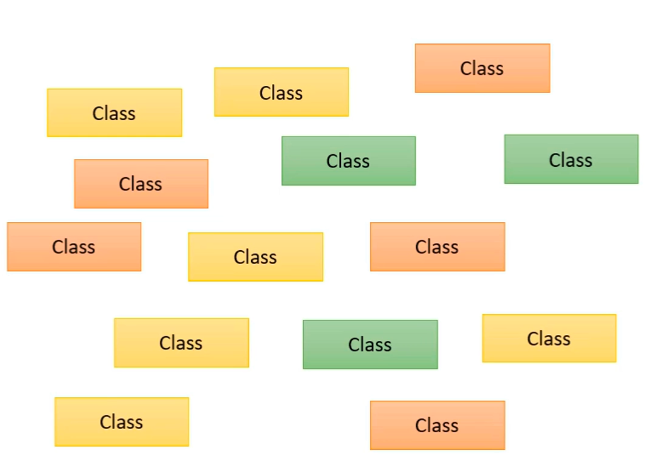
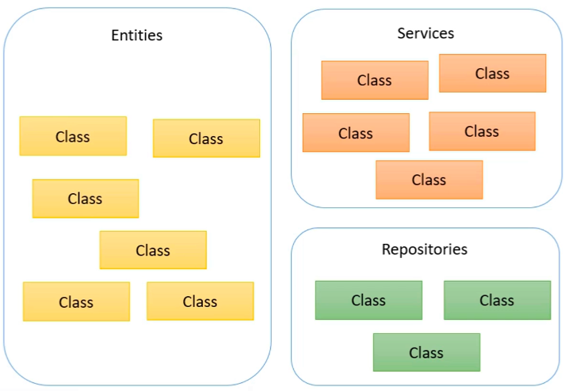
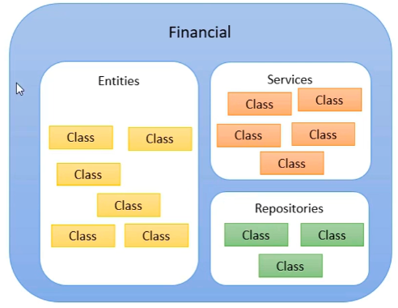

# 

---
## Java linguagem orientada ao objetos:

- A unidade lógica básica de um código em Java é a **Classe**.

**Todo código em java tem que estar dentro de uma classe!!!**

---

## Pacote (Package)

- **Uma pacote é = uma agrupamento de classes que estão de alguma maneira relacionadas.**

| Categoria | Oque tem nela |
| --------- | ------------- |
| Serviços  | Vou ter uma classe de serviçoes |

---

## Módulo - Introduzido no Java9+

**MÓDULO = É O AGRUPAMENTO LÓGICO**
**- Ele é um agrupamento dos pacotes vistos anteriormente só que estão relacionados**

**Runtime = É o agrupamento físico**

Quando o agrupamento é lógico ele está em nível conceitual e no nível de código como os módulos, mas esses agrupamentos lógicos podem ser compilados, assim, gerando um build (**RunTime**) que ai sim entra no agrupamento físico que estaria representado por aquivos.

---

## Aplicação = Agrupamento de módulos que se relacionam

